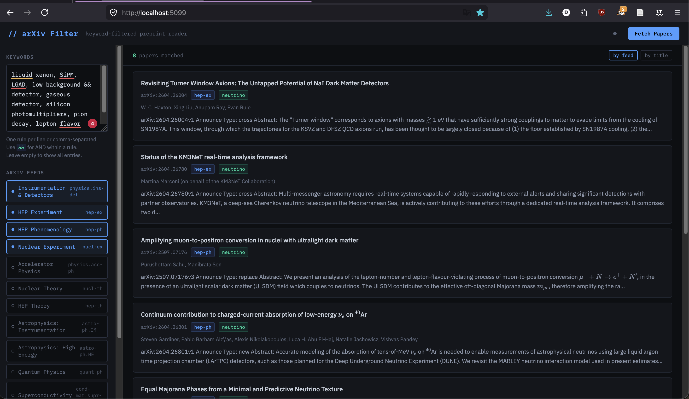

# README

Simple arXiv RSS feed filtering for key-words with toggleable sources and config saving



## Instructions

### Manual testing

First time, build conda minienv (or do something else to get dependencies, its your life)
`conda env create -f env.yml`

Then you can run:
`conda activate arxivfeed`
`python app.py`

Open browser to `http://localhost:5099`

And admire!

## Setting up macOS automated server

Add this file:

```
~/Library/LaunchAgents/com.arxivfeed.server.plist
```

<?xml version="1.0" encoding="UTF-8"?>
<!DOCTYPE plist PUBLIC "-//Apple//DTD PLIST 1.0//EN"
  "http://www.apple.com/DTDs/PropertyList-1.0.dtd">
<plist version="1.0">
<dict>
    <key>Label</key>
    <string>com.arxivreader.server</string>

    <key>ProgramArguments</key>
    <array>
        <string>/Users/USERNAME/miniconda3/envs/arxivfeed/bin/python</string>
        <string>/Users/USERNAME/place/where/code/lives/arxivfeed/app.py</string>
    </array>

    <key>RunAtLoad</key>
    <true/>

    <key>KeepAlive</key>
    <true/>

    <key>StandardOutPath</key>
    <string>/Users/USERNAME/Library/Logs/arxivreader.log</string>

    <key>StandardErrorPath</key>
    <string>/Users/USERNAME/Library/Logs/arxivreader.err</string>
</dict>
</plist>
```

### Stop the server

`launchctl unload ~/Library/LaunchAgents/com.arxivfeed.server.plist`

### Restart after code changes

```
launchctl unload ~/Library/LaunchAgents/com.arxivfeed.server.plist
launchctl load ~/Library/LaunchAgents/com.arxivfeed.server.plist
```

Check if its running:
`curl -s -o /dev/null -w "%{http_code}" http://localhost:5099`
    This should return 200.


### Check logs

```
tail -f ~/Library/Logs/arxivfeed.log
tail -f ~/Library/Logs/arxivfeed.err
```
